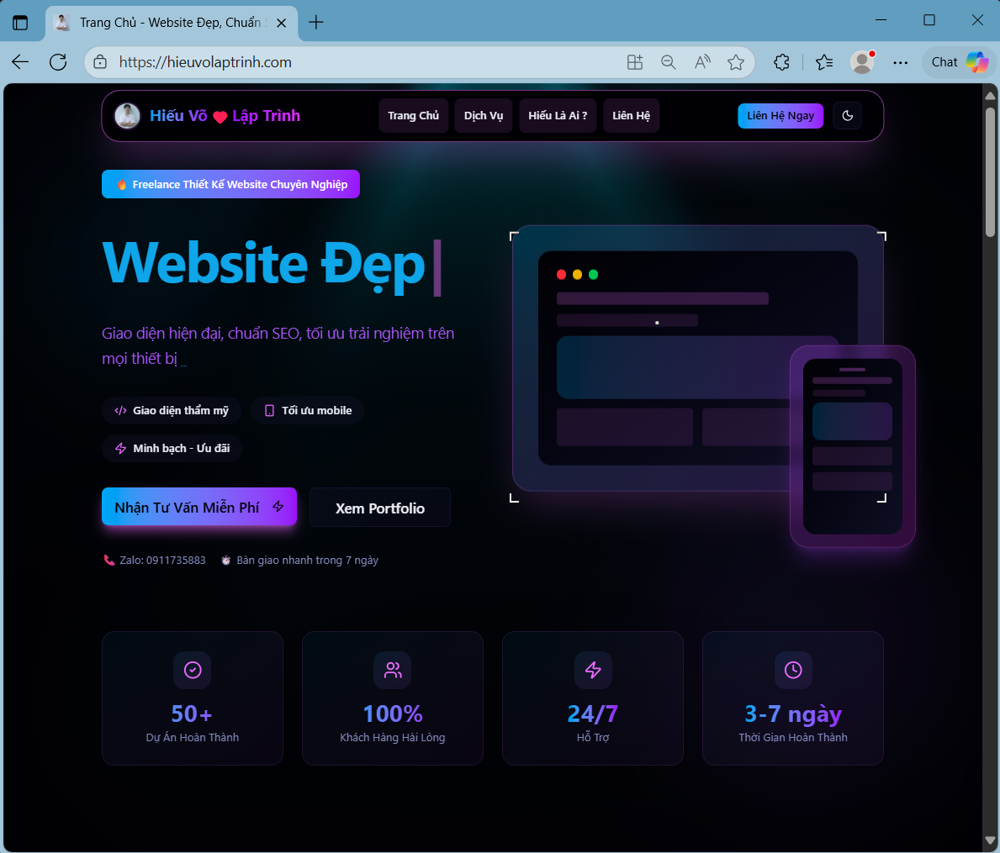
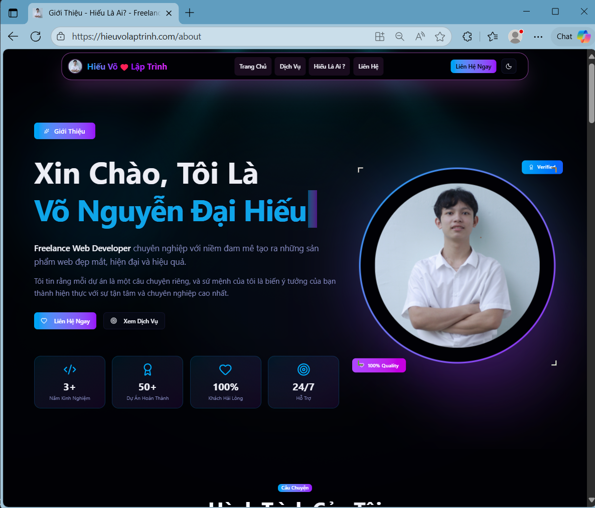
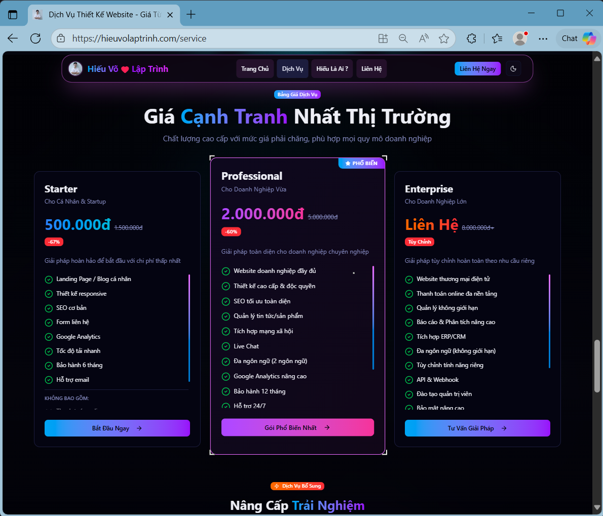

<!-- Portfolio Link Section -->
<div align="center" style="margin: 20px 0;">
  <a href="https://hieuvolaptrinh.com/" target="_blank">
    
  </a>
</div>

<!-- Header với animation và gradient background -->
<div align="center" style="background: linear-gradient(135deg, #667eea 0%, #764ba2 100%); padding: 60px 20px; border-radius: 20px; margin-bottom: 30px;">
  
  
  <div style="margin-top: 20px;">
    
    
    
  </div>
</div>

<!-- Portfolio Preview Frame -->
<div align="center" style="margin: 40px 0;">
  <h2 style="color: #667eea; font-size: 28px; margin-bottom: 20px;">
    🎨 Portfolio Preview
  </h2>
  <div style="position: relative; padding: 20px; background: linear-gradient(135deg, #667eea 0%, #764ba2 100%); border-radius: 15px; box-shadow: 0 10px 40px rgba(102, 126, 234, 0.3);">
    <a href="https://hieuvolaptrinh.com/" target="_blank">
      
    </a>
    
    <!-- Portfolio Screenshots Grid -->
    <table style="width: 100%; border-collapse: collapse;">
      <tr>
        <td align="center" style="padding: 10px;">
          <a href="https://hieuvolaptrinh.com/" target="_blank">
            
          </a>
          <p style="color: white; margin-top: 10px; font-size: 14px; font-weight: bold;">🏠 Trang Chủ</p>
        </td>
        <td align="center" style="padding: 10px;">
          <a href="https://hieuvolaptrinh.com/about" target="_blank">
            
          </a>
          <p style="color: white; margin-top: 10px; font-size: 14px; font-weight: bold;">👨‍💻 Giới Thiệu</p>
        </td>
        <td align="center" style="padding: 10px;">
          <a href="https://hieuvolaptrinh.com/service" target="_blank">
            
          </a>
          <p style="color: white; margin-top: 10px; font-size: 14px; font-weight: bold;">💼 Dịch Vụ</p>
        </td>
      </tr>
    </table>
    
    <p style="color: white; margin-top: 20px; font-size: 14px;">
      ✨ Explore my projects, skills, and professional journey ✨
    </p>
  </div>
</div>

<div align="center">
  
</div>
<div align="center">


</div>
<!-- Main content với improved layout -->
<div align="center">
  
<table>
<tr>
<td width="50%" valign="top">

<!-- About Me Section -->

# 💫 About Me

<div style="background: linear-gradient(135deg, #f5f7fa 0%, #c3cfe2 100%); padding: 30px; border-radius: 15px; border-left: 5px solid #667eea; margin: 20px 0;">

### 🚀 **Fullstack Developer & Tech Enthusiast**

_IT Student at The University of Danang - University of Technology and Education_

---

### 🎯 **My Mission**

Passionate about crafting **end-to-end digital solutions** that bridge the gap between elegant user experiences and powerful backend architectures.

### 🛠️ **Core Expertise**

- **🎨 Frontend:** React, Vue.js, Angular, Next.js, TypeScript
- **⚙️ Backend:** Java Spring Boot, Node.js, Express, NestJS
- **🗄️ Database:** MySQL, MongoDB, PostgreSQL, Redis
- **☁️ DevOps:** Docker, AWS, CI/CD, Microservices

### 🌱 **Current Focus**

- 🏗️ Microservices Architecture & System Design
- 🔐 Security Best Practices & Authentication
- 📊 Performance Optimization & Monitoring
- 🤖 AI/ML Integration in Web Applications

</div>

<div align="center">

</td>
<td width="50%" valign="top">

<!-- Tech Stack Section -->

# 🛠️ Tech Stack & Tools

<div align="center">

### 💻 **Programming Languages**

<div style="display: flex; flex-wrap: wrap; gap: 8px; margin: 15px 0; animation: fadeInUp 1.5s ease-out;">
  
  
  
  
  
  
</div>

### 🎨 **Frontend Development**

<div style="display: flex; flex-wrap: wrap; gap: 8px; margin: 15px 0; animation: fadeInUp 1.8s ease-out;">
  
  
  
  
  
  
</div>

### ⚙️ **Backend Development**

<div style="display: flex; flex-wrap: wrap; gap: 8px; margin: 15px 0; animation: fadeInUp 2.1s ease-out;">
  
  
  
  
  
</div>

### 🗄️ **Databases**

<div style="display: flex; flex-wrap: wrap; gap: 8px; margin: 15px 0; animation: fadeInUp 2.4s ease-out;">
  
  
  
  
</div>

### ☁️ **Cloud & DevOps**

<div style="display: flex; flex-wrap: wrap; gap: 8px; margin: 15px 0; animation: fadeInUp 2.7s ease-out;">
  
  
  
  
</div>

### 📱 **Mobile & Tools**

<div style="display: flex; flex-wrap: wrap; gap: 8px; margin: 15px 0; animation: fadeInUp 3s ease-out;">
  
  
  
  
</div>

</div>

</td>
</tr>
</table>

</div>

### � **What Drives Me**

```javascript
const myPassion = {
  frontend: "Creating intuitive & responsive UIs",
  backend: "Building scalable & secure APIs",
  database: "Designing efficient data architectures",
  devops: "Automating deployment pipelines",
  learning: "Always exploring new technologies",
};
```

## 🌐 Connect With Me:

<div align="center">
  
[](https://www.facebook.com/HieuVo.hv)
[](https://www.tiktok.com/@hieu_vo05)
[](https://youtube.com/@https://www.youtube.com/@hieuvoiuem)
[](mailto:vndhieuak@gmail.com)

</div>

---

<h2 align="center">📊 GitHub Analytics</h2>

<div align="center">
  


</div>

## 🏆 GitHub Achievements

<div align="center">
  


</div>

<div align="center">
  
### 💭 Developer Quote
  


</div>

---

<div align="center">
  
⭐️ **From [hieuvolaptrinh](https://github.com/hieuvolaptrinh)** with ❤️


</div>
